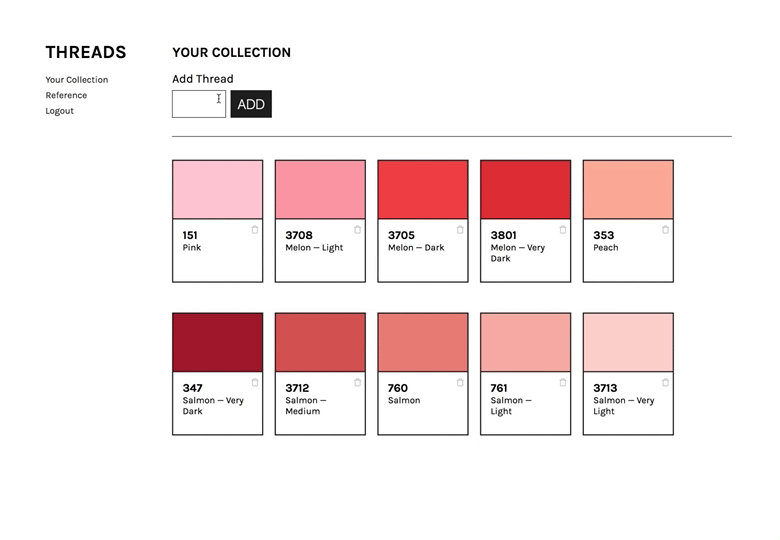

# Threads

Threads is an embroidery thread collection tracker.

---

### Purpose

Have a quick reference for a thread collection.

### Goal

The goal of this project was to make a thread tracker while learning to create a site that utilizes oAuth, Passport, MongoDB, and Express.

#### TODO

- [ ] Create login component on reference page
- [ ] Write filter function for collection
- [ ] Write sort function for collection
